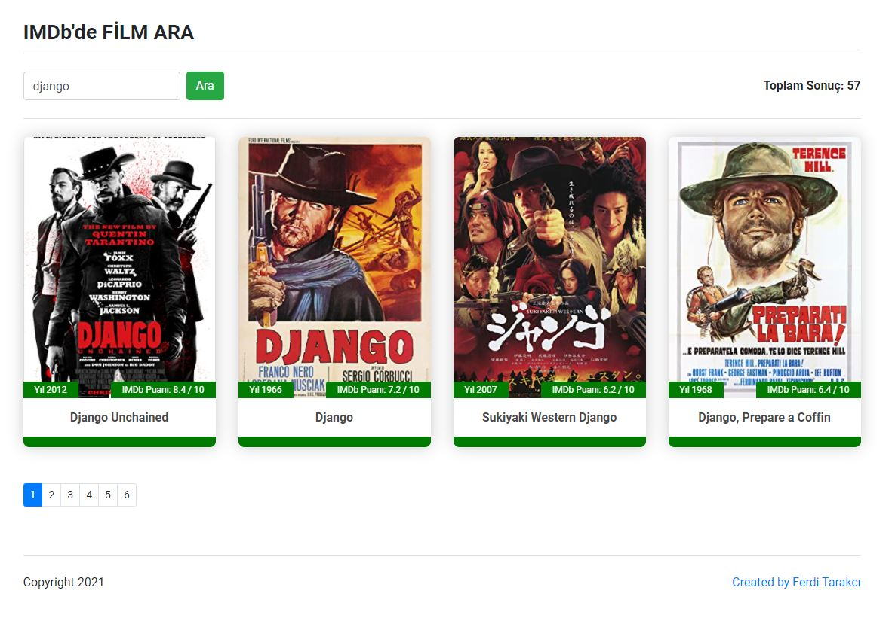
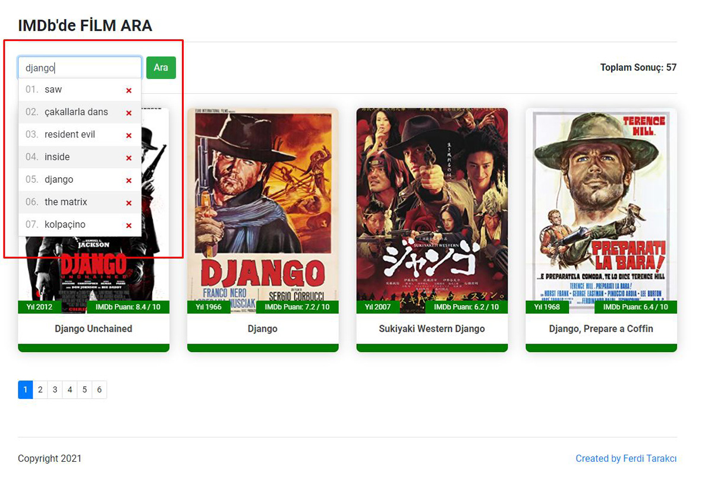

# Movie Search App with Vue 3
## Vue 3 ile Film Arama Uygulaması

Yıllar önce HTML5, SCSS/CSS3 ve jQuery teknolojileri ile geliştirdiğim ve filmleri OMDb API'sini sorgulayarak listelediğim bir uygulamaydı. Şimdi **Vue 3** ile biraz daha geliştirerek yeniden kodladım.

Demo: [https://movie-search.ferditarakci.com.tr](https://movie-search.ferditarakci.com.tr)

### Kullanım
OMDb Api key oluşturmak için https://www.omdbapi.com/apikey.aspx linkine gidin.
Generate API Key bölümünden API anahtarınızı oluşturup **.env veya .env.development veya .env.local** dosyasında **VUE_APP_API_KEY** değişkenine ekleyin.

### English
It was an application that I developed years ago with HTML5, SCSS/CSS3 and jQuery technologies and I listed movies by querying the OMDb API. Now I've re-coded it with **Vue 3** by developing it a bit more.

### Usage
To generate OMDb Api key, go to https://www.omdbapi.com/apikey.aspx.
Generate your API key from the Generate API Key section and add it to the **VUE_APP_API_KEY** variable in the **.env or .env.development or .env.local** file.

<br>

```html
<Movies :apiKey="process.env.VUE_APP_API_KEY" ... />
Add VUE_APP_API_KEY = "API_KEY" in .env or .env.development or .env.local file
```

<br>

## Project setup
```
npm install
```

### Compiles and hot-reloads for development
```
npm run serve
```

### Compiles and minifies for production
```
npm run build
```

### Lints and fixes files
```
npm run lint
```

### Customize configuration
See [Configuration Reference](https://cli.vuejs.org/config/).


<br><br>

<br>